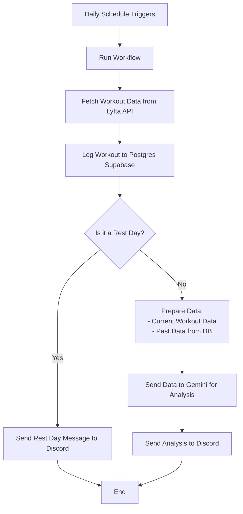

# Gym Workout Analyser

An automated, serverless data pipeline that fetches daily workout data from Lyfta, persists structured workout logs in Postgres, optionally performs training analysis using an LLM, and delivers a daily report via Discord. The entire system runs unattended using GitHub Actions and is designed to be reproducible, low-maintenance, and free-tier friendly.

This project is intentionally backend-only. There is no UI, no dashboard, and no manual intervention required once configured.

---

## Table of Contents

* Overview
* System Architecture
* Data Flow (End-to-End)
* Design Decisions
* Database Model
* LLM Analysis
* Notification System
* Scheduling
* Setup Guide
* Configuration
* Local Development
* Operational Notes
* Limitations
* Status

---

## Overview

The Gym Workout Analyser runs once per day and performs the following tasks:

* Fetches the current day’s workout from the Lyfta API
* Determines whether the day is a workout day or a rest day
* Stores curated workout data in Postgres
* Enforces a rolling data retention window
* Optionally analyzes recent training history using an LLM
* Sends a structured report via Discord

All external services (Lyfta, Gemini, Discord) are treated as best-effort. Failures do not halt the pipeline.

---

## System Architecture



---

## Data Flow (End-to-End)

1. **Trigger**
   The pipeline is triggered automatically by GitHub Actions on a daily cron schedule. A manual trigger is also available for testing.

2. **Workout Fetch**
   The Lyfta API is queried for the current day’s workout. If no workout is found, the day is classified as a rest day.

3. **Data Normalization**
   Raw Lyfta responses are transformed into a curated internal format. Only the following information is retained:

   * workout date
   * workout title
   * total volume
   * exercise names
   * sets (weight × reps)

   Raw third-party JSON is intentionally not stored.

4. **Persistence**
   The normalized workout or rest day is stored in Postgres. Writes are idempotent and safe to re-run.

5. **Retention Enforcement**
   Any data older than 12 months is automatically deleted during each run.

6. **Analysis (Optional)**
   The last 4 weeks of workouts are retrieved and sent to an LLM for analysis. Missing dates are treated as rest days via prompt instruction. If analysis fails, the pipeline continues without interruption.

7. **Notification**
   A formatted daily report is delivered to a private Discord channel using a webhook.

---

## Design Decisions

* **Event-based storage**: Only workouts are stored historically. Rest days are implicit and inferred from date gaps.
* **Explicit rest days going forward**: Daily runs log rest days explicitly to maintain forward consistency.
* **No raw API storage**: Prevents schema drift and reduces data coupling to third-party APIs.
* **Idempotent writes**: Safe to re-run the pipeline without duplication.
* **Best-effort integrations**: External service failures do not stop the pipeline.
* **No local state**: All state lives in Postgres.

---

## Database Model

```sql
workouts (
  id SERIAL PRIMARY KEY,
  workout_date DATE UNIQUE,
  title TEXT,
  description TEXT,
  total_volume INTEGER,
  is_rest_day BOOLEAN,
  created_at TIMESTAMP DEFAULT now()
)
```

* `description` contains a curated, human-readable summary of exercises and sets
* `is_rest_day` distinguishes explicit rest days from workout days

---

## LLM Analysis

LLM analysis is optional and controlled entirely via configuration.

* The LLM receives:

  * today’s workout
  * the last 4 weeks of workouts (chronologically ordered)
* Rest days are not sent explicitly
* Missing dates are treated as rest days via prompt instruction

### Modes

```bash
GEMINI_MODE=False| True
```

* `False`: Returns a fixed analysis response (default, for testing)
* `True`: Calls the Gemini API

LLM failures (rate limits, overloads, network issues) do not interrupt the pipeline.

---

## Notification System

Reports are delivered using a Discord webhook.

* A private Discord server and channel are used
* Messages are sent via simple HTTP POST requests
* No bots, OAuth, or long-lived connections are required

This approach provides reliable delivery with minimal setup and zero cost.

---

## Scheduling

The pipeline runs daily at **10:00 PM IST**.

GitHub Actions cron configuration (UTC):

```yaml
cron: "30 16 * * *"
```

Manual execution is also supported via `workflow_dispatch`.

---

## Setup Guide

1. Clone the repository
2. Create a Supabase project (Postgres)
3. Create a private Discord server and webhook
4. Generate a Lyfta API key
5. (Optional) Generate a Gemini API key
6. Configure GitHub Secrets
7. Enable GitHub Actions

Once configured, no further manual steps are required.

---

## Configuration

All configuration is done via environment variables:

```
LYFTA_API_KEY
SUPABASE_DATABASE_URL
DISCORD_WEBHOOK_URL
GEMINI_API_KEY        # optional
GEMINI_MODE           # mock | real
```

Secrets are stored in GitHub Actions and never committed to the repository.

---

## Local Development

Local execution is supported for testing and debugging.

```bash
export GEMINI_MODE=mock
python src/main.py
```

Mock mode avoids all external LLM calls.

---

## Operational Notes

* The pipeline may run a few minutes late due to GitHub scheduling behavior
* External API outages are expected and handled gracefully
* Backfilling historical data was performed once and the tooling was removed afterward

---

## Limitations

* No UI or visualization layer
* No user management or authentication
* No training plan generation
* No real-time execution

These are intentional trade-offs.

---

## Status

* Fully operational
* Running daily via GitHub Actions
* No manual intervention required
* Stable and complete
