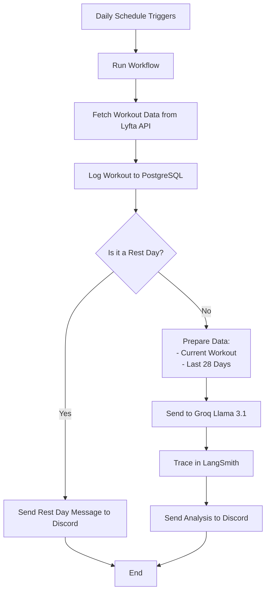

# Gym Workout Analysis

An automated, serverless data pipeline that fetches daily workout data from Lyfta, persists structured workout logs in PostgreSQL, performs training analysis using Groq Llama, and delivers a daily report via Discord. The entire system runs unattended using GitHub Actions and is designed to be reproducible, low-maintenance, and free-tier friendly.

This project is intentionally backend-only. There is no UI, no dashboard, and no manual intervention required once configured.

---

## Table of Contents

* Overview
* System Architecture
* Data Flow (End-to-End)
* Design Decisions
* Database Model
* LLM Analysis
* LangSmith Integration
* Notification System
* Scheduling
* Setup Guide
* Configuration
* Local Development
* Operational Notes
* Limitations
* Status

---

## Overview

The Gym Workout Analysis pipeline runs once per day and performs the following tasks:

* Fetches the current day's workout from the Lyfta API
* Determines whether the day is a workout day or a rest day
* Stores curated workout data in PostgreSQL
* Enforces a rolling data retention window
* Analyzes training history using Groq Llama 3.1 8B
* Traces all LLM calls via LangSmith for cost and latency tracking
* Sends a structured report via Discord

All external services (Lyfta, Groq, Discord) are treated as best-effort. Failures do not halt the pipeline.

---

## System Architecture


```mermaid
flowchart TD
    A[Daily Schedule Triggers] --> B[Run Workflow]
    B --> C[Fetch Workout Data from Lyfta API]
    C --> D[Log Workout to PostgreSQL]
    D --> E{Is it a Rest Day?}
    E -->|Yes| F[Send Rest Day Message to Discord]
    E -->|No| G[Prepare Data:<br/>- Current Workout<br/>- Last 28 Days]
    G --> H[Send to Groq Llama 3.1]
    H --> I[Trace in LangSmith]
    I --> J[Send Analysis to Discord]
    F --> K[End]
    J --> K[End]
```

---

## Data Flow (End-to-End)

1. **Trigger**
   The pipeline is triggered automatically by GitHub Actions on a daily cron schedule. A manual trigger is also available for testing.

2. **Workout Fetch**
   The Lyfta API is queried for the current day's workout. If no workout is found, the day is classified as a rest day.

3. **Data Normalization**
   Raw Lyfta responses are transformed into a curated internal format. Only the following information is retained:

   * workout date
   * workout title
   * total volume
   * exercise names
   * sets (weight × reps)

   Raw third-party JSON is intentionally not stored.

4. **Persistence**
   The normalized workout or rest day is stored in PostgreSQL. Writes are idempotent and safe to re-run.

5. **Retention Enforcement**
   Any data older than 12 months is automatically deleted during each run.

6. **Analysis (Optional)**
   The last 28 days of workouts are retrieved and sent to Groq Llama 3.1 8B for analysis. Missing dates are treated as rest days via prompt instruction. If analysis fails, the pipeline continues without interruption.

7. **LangSmith Tracing**
   All LLM calls are traced via LangSmith for cost and latency tracking. Viewable at langsmith.app.

8. **Notification**
   A formatted daily report is delivered to a private Discord channel using a webhook.

---

## Design Decisions

* **Event-based storage**: Only workouts are stored historically. Rest days are implicit and inferred from date gaps.
* **Explicit rest days going forward**: Daily runs log rest days explicitly to maintain forward consistency.
* **No raw API storage**: Prevents schema drift and reduces data coupling to third-party APIs.
* **Idempotent writes**: Safe to re-run the pipeline without duplication.
* **Best-effort integrations**: External service failures do not stop the pipeline.
* **No local state**: All state lives in PostgreSQL.
* **LangSmith for observability**: Track LLM costs, latency, and traces without additional infrastructure.

---

## Database Model

```sql
workouts (
  id SERIAL PRIMARY KEY,
  workout_date DATE UNIQUE,
  title TEXT,
  total_volume INTEGER,
  exercise_count INTEGER,
  set_count INTEGER,
  description JSONB,
  is_rest_day BOOLEAN NOT NULL,
  created_at TIMESTAMP DEFAULT now()
)
```

* `description` contains a curated, human-readable summary of exercises and sets
* `is_rest_day` distinguishes explicit rest days from workout days
* Index on `workout_date` for query performance

---

## LLM Analysis

LLM analysis uses Groq's Llama 3.1 8B Instant model. It's optional and controlled via configuration.

* The LLM receives:
  * today's workout
  * the last 28 days of workouts (chronologically ordered)
* Rest days are not sent explicitly
* Missing dates are treated as rest days via prompt instruction

### Configuration

```bash
LLM_PROVIDER=groq           # default: groq
LLM_MODEL=llama-3.1-8b-instant  # default model
LLM_MOCK=false              # true to use mock response (for testing)
```

### Mock Mode

Set `LLM_MOCK=true` to return a fixed analysis response for testing without calling Groq.

LLM failures do not interrupt the pipeline.

---

## LangSmith Integration

All LLM calls are traced via LangSmith for observability.

* **Cost tracking**: Token usage per request
* **Latency tracking**: Response times
* **Traces**: Full prompt/response history

View at: https://langsmith.app

### Configuration

```bash
LANGSMITH_ENABLED=true              # default: true
LANGSMITH_API_KEY=your_api_key    # required for LangSmith
LANGSMITH_PROJECT=Gym Workout Analysis  # project name
```

---

## Notification System

Reports are delivered using a Discord webhook.

* A private Discord server and channel are used
* Messages are sent via simple HTTP POST requests
* No bots, OAuth, or long-lived connections are required

This approach provides reliable delivery with minimal setup and zero cost.

---

## Scheduling

The pipeline runs daily at **10:00 PM IST**.

GitHub Actions cron configuration (UTC):

```yaml
cron: "30 16 * * *"
```

Manual execution is also supported via `workflow_dispatch`.

---

## Setup Guide

1. Clone the repository
2. Create a Supabase project (PostgreSQL)
3. Create a private Discord server and webhook
4. Generate a Lyfta API key
5. Generate a Groq API key (console.groq.com)
6. (Optional) Generate a LangSmith API key (langsmith.app)
7. Configure GitHub Secrets
8. Enable GitHub Actions

Once configured, no further manual steps are required.

---

## Configuration

All configuration is done via environment variables:

### Required
```
LYFTA_API_KEY
SUPABASE_DATABASE_URL
DISCORD_WEBHOOK_URL
GROQ_API_KEY
```

### Optional
```
LLM_PROVIDER=groq           # default: groq
LLM_MODEL=llama-3.1-8b-instant
LLM_MOCK=false
LANGSMITH_ENABLED=true
LANGSMITH_API_KEY          # for LangSmith
LANGSMITH_PROJECT=Gym Workout Analysis
REST_DAY_MESSAGE          # custom rest day message
DRY_RUN                   # skip DB writes
```

Secrets are stored in GitHub Actions and never committed to the repository.

---

## Local Development

Local execution is supported for testing and debugging.

```bash
# Run with mock LLM (no API calls)
LLM_MOCK=true python src/main.py

# Run with real LLM
GROQ_API_KEY=your_key python src/main.py
```

---

## Operational Notes

* The pipeline may run a few minutes late due to GitHub scheduling behavior
* External API outages are expected and handled gracefully
* LangSmith traces available for debugging LLM calls

---

## Limitations

* No UI or visualization layer
* No user management or authentication
* No training plan generation
* No real-time execution

These are intentional trade-offs.

---

## Status

* Fully operational
* Running daily via GitHub Actions
* LangSmith integration for observability
* No manual intervention required
* Stable and complete